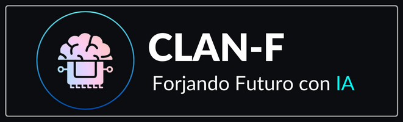

---
runme:
  id: 01HG435HE618D8KH6V2TY9ZC2D
  version: v2.0
---

# CLAN-F--e-commerce

**E-commerce de productos innovadores, tanto de línea personal como del hogar, con Inteligencia Artificial integrada.**

Este es un proyecto Open Source desarrollado como proyecto del curso [Full Stack Python](https://agenciadeaprendizaje.bue.edu.ar/curso/fullstack-con-python-cac-4-0/) de [Codo a Codo](https://buenosaires.gob.ar/educacion/codocodo/el-programa).

### Developer Team 💻:

- [Alberto Márquez](https://github.com/YeiAlb)
- [Carina Payleman](https://github.com/PaylemanC)
- [Francisco Javier Zani](https://github.com/Franjazani)

## Tecnologías utilizadas 🛠️:

* HTML y CSS
* Javascript
* Python
* DJANGO
* MYSQL
